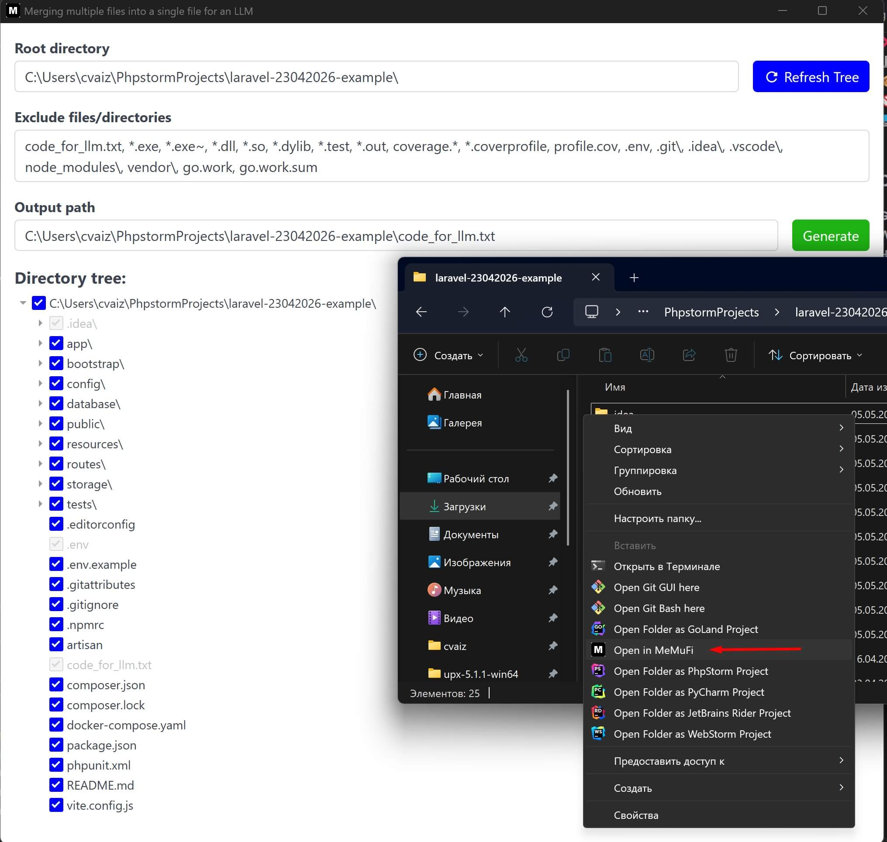

# MeMuFi

**Version:** 1.0

MeMuFi is a cross-platform GUI application for merging multiple files and directories into a single text file, optimized for use with Large Language Models (LLMs).

The application allows you to select files and folders, apply include and exclude rules, generate a directory tree, and combine file contents into one output file.

## Features

* 📁 Directory tree browsing
* ✅ Select files and folders to include
* ❌ Exclude files and directories using patterns
* 🧾 Generate a textual project structure
* 📦 Merge file contents into a single output file
* 🚫 Automatic detection of binary files
* 🖥️ Cross-platform support (Windows, ~~macOS~~, Linux)

## Tech Stack

* **Go** — backend
* **Wails** — desktop GUI framework and build system
* **HTML / CSS / JavaScript** — frontend

## OS

* **Linux** - Ubuntu 24.04, Ubuntu 25.04, Ubuntu 26.04
* **Windows** - Windows 10, Windows 11

## Usage

### Linux

After installation, to run in the desired directory, run the command `memufi`.

### Windows



### Output File Structure

```
Directory structure:
└── project/
    ├── file1.go
    └── file2.exe

================================================
FILE: project/file1.go
================================================
<file contents>

================================================
FILE: project/file2.exe
================================================
[Binary file]
```

1. Launch the application
2. Select the root project directory
3. Choose files and folders to include
4. Optionally define exclude rules
5. Specify the output file path
6. Click **Generate**

The generated file will contain:

* the directory structure
* the contents of all included text files

## Build the Application

Ubuntu 24.04 and later
```bash
wails build -tags webkit2_41 -o memufi-ubuntu-amd64.run
make build_deb
```

Windows
```bash
wails build -skipbindings -nsis -upx -platform windows/amd64 -o memufi-amd64.exe
```

## Build the Application via Docker

Ubuntu 24.04 and later
```bash
docker compose run --rm ubuntu linux -tags webkit2_41 -o memufi-ubuntu-amd64.run
make build_deb
```

Windows
```bash
docker compose run --rm windows windows -nsis -upx -o memufi-amd64.exe
```

The resulting binary will be located in:

```
build/bin/
```


## License

[MIT](LICENSE)